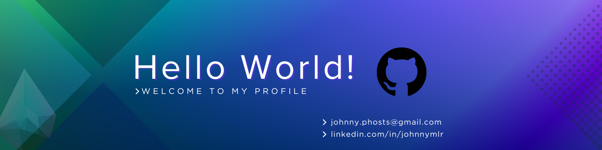
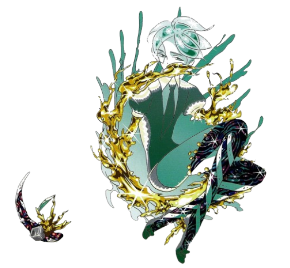

<!--Banner-->

<!--Image-->

  

<!--Header Name-->
#   ɪ'ᴍ ᴊᴏʜɴɴʏ!
*Software Developer*
  

<!--Start Intro-->               

Full Stack Developer with a strong passion for Angular, React, Flutter, React-Native, Node.js, and crafting intuitive user experiences for software based solutions.

- ✨ Student of life, trying to be better everyday
- 🌱 I’m currently learning many things, I see each day as a chance to grow and improve.
- 🌍 Passionate about building scalable web and mobile apps.
- 📚 Tech enthusiast with interest in design patterns and performance.
- 💬 Open to mentorship, collaboration, and meaningful feedback.
<!-- - 💻 Visit my [Portfolio]() for more details about my personal projects. -->
<!--End Intro-->

<!--Profile Count Badge-->

  
  

---

<!--Languages and Tools Section-->       
<h2 align="center" style="padding-bottom:20px">Tᴇᴄʜ Sᴛᴀᴄᴋ & Rᴇᴄᴇɴᴛ Pʀᴏᴊᴇᴄᴛs</h2>
<picture>
  <source media="(prefers-color-scheme: dark)" srcset="./Skills_Animation_Dark.gif">
  <source media="(prefers-color-scheme: light)" srcset="./Skills_Animation_White.gif">
  
</picture>
 

<h3 align="left">Current Learning</h3>
<ul align="left">
  <li>Deepening my knowledge in Backend Development with Node.js, Relational Databases.</li>
  <li>Exploring advanced React.js patterns for modern web development</li>
  <li>Improving my skills in mobile development with Flutter and React Native.</li>
</ul>
  
<h3 align="left">Some of my Recent Projects</h3>
<ul align="left">
  <li><a href="https://github.com/HrHrM/Flutter-TMDB-App">📱Flutter Movie Database App🎥</a></li>
  <li><a href="https://github.com/HrHrM/employee-evaluation-system">✨Employee Evaluation System made with React, Tailwind, Express and MongoDB✨</a></li>
</ul>
 
 
 
 

<!--Github stats Table--> 
<h2 align="center">📊 Gɪᴛʜᴜʙ Sᴛᴀᴛs 📊</h2>
<table width="100%">
  <tr>
    <td width="50%">
      <h3 align="center"><strong>Gɪᴛʜᴜʙ Sᴛᴀᴛs</strong></h3>
      

        
      

    </td>
    <td width="50%">
      <h3 align="center"><strong>Sᴛʀᴇᴀᴋ Sᴛᴀᴛs</strong></h3>
      

        
      

    </td>
  </tr>
  <tr>
    <td width="50%">
      <h3 align="center"><strong>Lᴀᴛᴇsᴛ Pʀᴏᴊᴇᴄᴛ</strong></h3>
      

        
      

    </td>
    <td width="50%">
      <h3 align="center"><strong>Top Languages</strong></h3>
      

        
      

    </td>
  </tr>
</table>
 

<!--Contribution Graph-->
<h2 align="center">📈 Cᴏɴᴛʀɪʙᴜᴛɪᴏɴ Gʀᴀᴘʜ 📈</h2>

  

---

<!--Dynamic Quote card updates everyday at 12 PM--> 
<h2 align="center">🌟 Tʜᴏᴜɢʜᴛ ᴏғ ᴛʜᴇ Dᴀʏ 🌟</h2>

<!--STARTS_HERE_QUOTE_CARD-->

  

<!--ENDS_HERE_QUOTE_CARD-->

<!--Contact Section--> 
<h2 align="center">🤝 Cᴏɴɴᴇᴄᴛ Wɪᴛʜ Mᴇ 📧 </h2>
  

  
  
  
    
  <!--  -->

 

<!--Footer--> 

  

